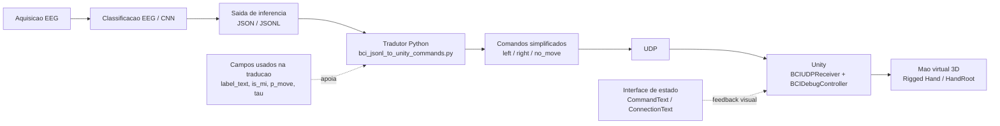

# Diagrama da Arquitetura


```mermaid
flowchart LR
    A["Aquisicao EEG"] --> B["Classificacao EEG / CNN"]
    B --> C["Saida de inferencia<br/>JSON / JSONL"]
    C --> D["Tradutor Python<br/>bci_jsonl_to_unity_commands.py"]
    D --> E["Comandos simplificados<br/>left / right / no_move"]
    E --> F["UDP"]
    F --> G["Unity<br/>BCIUDPReceiver + BCIDebugController"]
    G --> H["Mao virtual 3D<br/>Rigged Hand / HandRoot"]

    I["Campos usados na traducao<br/>label_text, is_mi, p_move, tau"] -.apoia .-> D
    J["Interface de estado<br/>CommandText / ConnectionText"] -.feedback visual .-> G
```

## Observacao

Este diagrama representa a arquitetura validada na etapa atual do prototipo:

```text
EEG/CNN -> JSONL -> Python -> UDP -> Unity -> mao 3D
```
